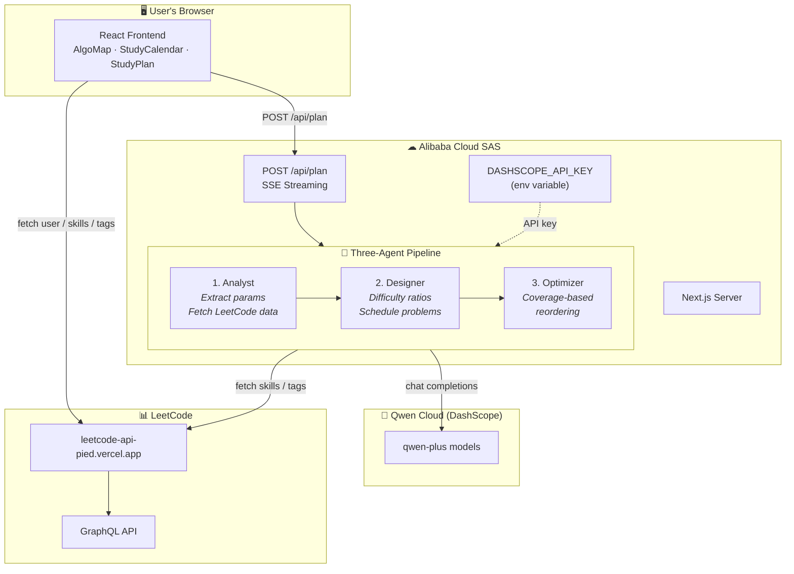
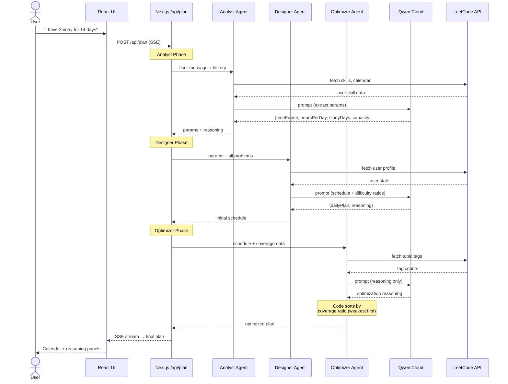
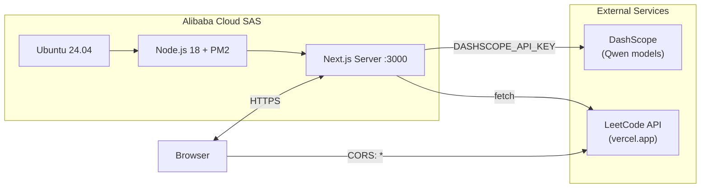

# AlgoPlanner — Architecture

## System Overview

## Data Flow — Study Plan Generation

## Deployment Architecture

## Key Design Decisions

| Decision | Rationale |
|----------|-----------|
| **API key on server only** | `DASHSCOPE_API_KEY` is an env variable on SAS; never sent to browser |
| **SSE streaming** | Users see agent progress in real-time (Analyst → Designer → Optimizer) |
| **LeetCode calls from browser** | Avoids proxying user cookies through server; CORS already open (`*`) |
| **Coverage ratio in code, not LLM** | Ordering is deterministic; LLM writes reasoning text only |
| **PM2 process manager** | Auto-restart on crash, startup on boot |
| **Sequential agent pipeline** | Each agent depends on the previous one's output |

## Tech Stack

| Layer | Technology |
|-------|-----------|
| Framework | Next.js 16 (App Router) |
| UI | React 19, D3.js, Tailwind CSS |
| Language | TypeScript |
| AI Models | Qwen (DashScope) — qwen-plus variants |
| Hosting | Alibaba Cloud SAS — Ubuntu 24.04, 1 GB RAM, 2 vCPU |
| Process | PM2 |
